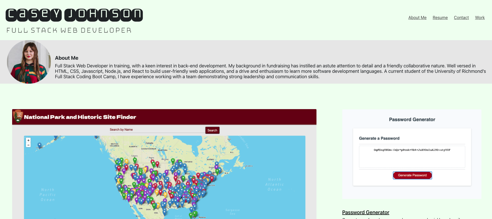
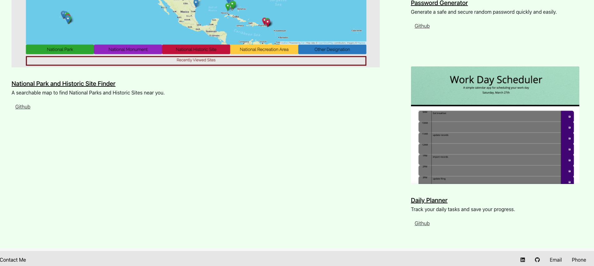

# cj_Portfolio

[Link to Portfolio Website](https://johnsoncm.github.io/cj_Portfolio/) 

I took the feedback from my previous portfolio assignment and applied it to my improved portfolio. Though maybe not 100% there - this website is more responsive and well designed than the previous. I was able to utilize CSS libraries to help with the layout. I also worked on improving the semantic html to assist the screen reader to interpret my site to better serve users with vision impairments.

I will continue to improve my portfolio. I know I have too many media queries. I think I had an issue with competeing styles in the CSS library vs. my own styling on my nav bar, causing me to need more media queries. At this point I just want to get the site working, and then I can explore ways to make it function better with less code.

**Website Behavior** 
When the links in the navbar are clicked, the user is taken to those sections of the website. When the user clicks the 'Resume' link, they are taken to a pdf of my resume. The project images are linked, as well as the project title. When these links are clicked, the user is taken to the application page in a separate tab. The github repos are also linked.

In the footer, my LinkedIn and Github profiles are linked, as well as my email and phone number.

****
****

**Porfolio Items:** 
[Link to Portfolio Website](https://johnsoncm.github.io/cj_Portfolio/) 
[Link to Resume](https://johnsoncm.github.io/cj_Portfolio/assets/Casey_Johnson_Resume_4.17.21.pdf) 
[Link to LinkedIn Profile](https://www.linkedin.com/in/casey-johnson-11336b4a/) 
[Link to Github Profile](https://github.com/johnsoncm) 

**Technologies Used:** 
HTML 
CSS 
Bootstrap 
Bulma 
Google Fonts 
Font Awesome 

**Contact Info:** 
Casey Johnson 
johnsoncm3@gmail.com 

